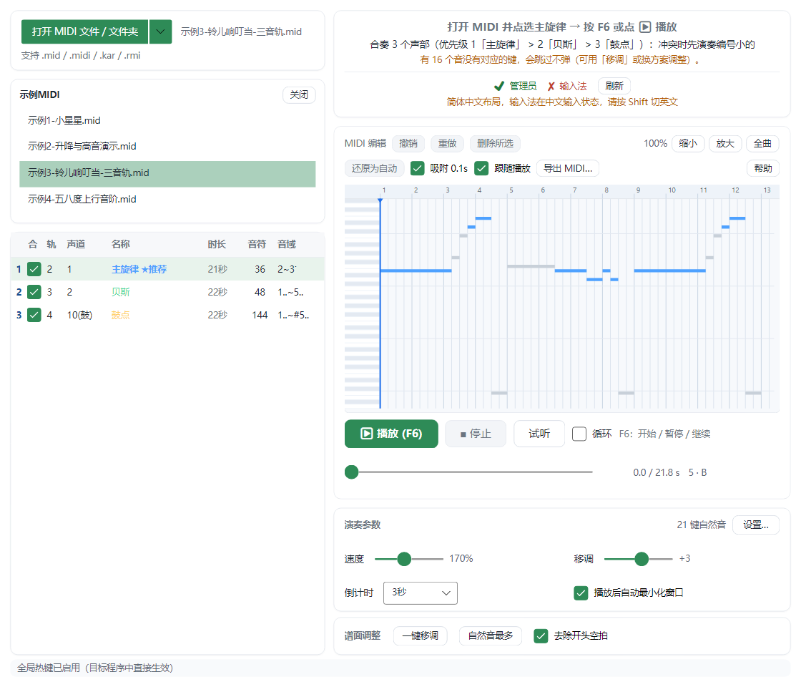
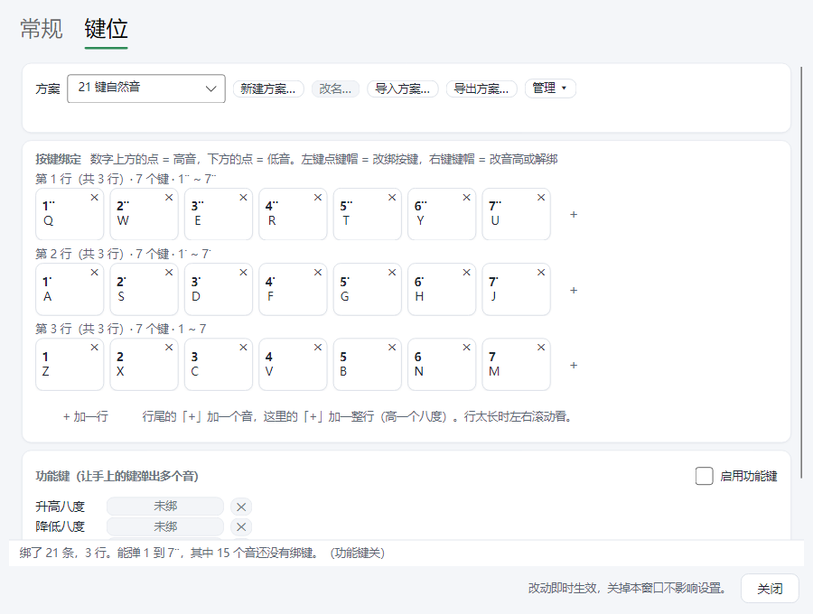
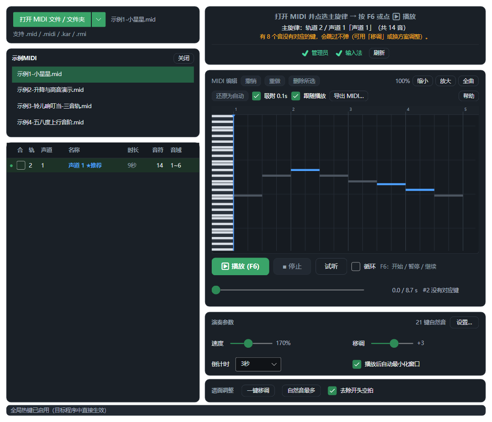

# MidiKeyPlayer 图文教程

把 MIDI 文件变成键盘、鼠标按键，弹给前台窗口里的目标程序听。
这份教程只讲最常用的操作，5 分钟能上手。细节都在 [README](../README.md)。

> ⚠️ 模拟按键可能违反第三方软件的规则，有封号风险。只在练习、测试或单机场景用，后果自负。

## 一、下载与启动

1. 打开仓库右侧 **Releases**，下载最新的 `MidiKeyPlayer-win-x64-x.x.x.zip`。
2. 解压，双击 `MidiKeyPlayer.exe`。
3. 弹 UAC 选「是」；弹 SmartScreen 选「更多信息」→「仍要运行」。
4. 杀毒软件报「模拟按键」是误报，加白名单。要把 `MidiKeyPlayer.exe` 和 `%TEMP%\.net` **一起**加，
   只加 exe 会启动失败。

第一次启动慢几秒是正常的（单文件 exe 在解压原生库）。

## 二、主界面一图看懂

- **左上**：打开 MIDI 文件或整个文件夹。开了文件夹就出现「文件夹曲目」列表，点哪首换哪首。
- **左下**：声轨列表。点一行设为主旋律（绿点 = 程序推荐），勾「合」可以多条轨一起弹。
- **右上**：状态卡。管理员、输入法两项打勾才能正常演奏。
- **中间**：卷帘，整首曲子的谱面，可以直接在上面改。
- **中下**：播放 / 停止 / 试听按钮和进度条。
- **右下**：速度、移调、倒计时，以及「设置…」按钮。

## 三、第一次播放：5 步

1. 点「**打开 MIDI 文件 / 文件夹**」，选一个 `.mid` 文件。
2. 在左下点带绿点的那一行（主旋律）。
3. 点「**试听**」先听听对不对（用的是 Windows 自带合成器，不发按键）。再点一下停止。
4. 点「**▶ 播放**」或按 **F6**，倒计时开始（默认 3 秒）。
5. **倒计时内切到目标窗口**（点一下目标窗口）。到点自动开弹。

弹错了想停：按 **F6**（播放中是暂停，再按继续）或点「■ 停止」。
鼠标键盘失控：狂按 **F6**。

## 四、播放前必须确认的 4 件事（没反应就来这里查）

1. 目标程序用**窗口化 / 无边框窗口化**，全屏独占收不到按键。
2. 播放前**点一下目标窗口**，它必须在前台。
3. 输入法切到**英文**，中文输入法会把按键截走。状态卡上「输入法」打勾才行。
4. 目标程序是管理员运行的，本程序也必须是管理员（它启动时会自己要权限）。

## 五、选声轨与合奏

- 点列表里的一行 = 选它当主旋律。绿点是推荐行，一般是旋律轨。
- 想多条轨一起出声：勾行首的「合」。编号 1 优先级最高，
  乐器一次只能发一个音，冲突时先弹编号小的。
- 列表文字的颜色和卷帘里音符的颜色一一对应。灰色的音 = 当前键位方案弹不了，会跳过。
- 打击乐轨也可以勾：有的目标乐器自带鼓组。

## 六、改谱：卷帘操作速查

谱面不满意，直接在卷帘上改：

| 操作 | 做法 |
|---|---|
| 加一个音 | **双击**空白处（按住拖动可一次定好长度） |
| 移动音符 | 拖音符中部（左右改时间，上下改音高） |
| 改长度 | 拖音符的左端或右端 |
| 删音 | **右键**点，或选中后按 Delete |
| 框选 | 空白处按住拖 |
| 撤销 / 重做 | Ctrl+Z / Ctrl+Y |
| 缩放 | 滚轮；Shift+滚轮 左右平移 |

改动只存在内存里。**要留档就点「导出 MIDI…」**，不然换轨、换歌就丢了。
顶部勾选「吸附 0.1s」后，拖动和加音会按 0.1 秒对齐，改起来更整齐。

## 七、键位方案（哪个音对应哪个键）

点主界面右下「**设置…**」→ 切到「**键位**」页：

- 内置四套方案，默认是「8 键半音」。图上这套「21 键自然音」：
  下排 `Z X C V B N M` = 中音 do..si，中排 `A S D F G H J` 高一个八度，上排 `Q W E R T Y U` 再高一个八度。
- 键帽上的大数字是简谱音高（1 = do，数字上方的点是高音、下方的点是低音）。
- **左键点键帽 = 改绑按键**（点一下再按你想用的键），**右键点键帽 = 改音高或解绑**。
- 行尾「+」加一个音，底下「+ 加一行」加一整行（高一个八度）。
- 底部那行统计告诉你哪些音还没绑键。
- 内置方案不能改，想自定义先点「新建方案…」复制一份。方案可以导出成 JSON 分享给别人。

## 八、设置窗口（常规页）

- **输入兼容**：三档，稳健 / 标准 / 极限。目标程序按帧读按键，间隔小于一帧就漏音。
  发现漏音就改成「稳健」。
- **热键**：F6 播放/暂停、F5 后退 5 秒、F7 前进 5 秒、F8 上一首、F9 下一首，全都能改或关掉。
- **皮肤**：浅色 / 深色 / 跟随系统，选了立即生效。
- **导出按键表**：导出 G HUB 脚本（.lua）或 CSV，内容和当前键位方案一致。

## 九、深色皮肤

设置 → 常规 → 界面 → 皮肤，选「深色（黑）」或「自动（跟随系统）」。

## 十、MIDI 设备实时演奏

接了 MIDI 键盘或打击垫，可以不做谱直接弹：

1. 设置 → 常规 → 勾「MIDI 设备实时演奏」。
2. 选好设备（没出现就点「刷新」，支持热插拔）。
3. 切到目标程序开弹。

MIDI 输入一次只能被一个程序占用：设备没反应，先看是不是被别的软件占着。

## 十一、常见问题速查

| 症状 | 怎么办 |
|---|---|
| 目标程序里完全没反应 | 按第四节逐项查：窗口化、点窗口、英文输入法、管理员 |
| 站着不动不漏音，一走位就漏 | 键盘硬件限制（按住 WASD 时矩阵吞键）。不是软件问题，只有全键无冲键盘能避免 |
| 偶尔缺音 | 设置里把「输入兼容」改成「稳健」，或把速度调低 |
| 鼠标键盘失控 | 狂按 **F6** |
| 启动失败、没任何提示 | 杀毒软件只白名单了 exe。把 `%TEMP%\.net` 也加进去 |
| 想暂时离开但不退出 | 最小化窗口。点 × 是彻底退出（会停播放、松开所有键） |

更详细的说明（悬浮窗、循环、自动更新、按键原理等）见 [README](../README.md)。
